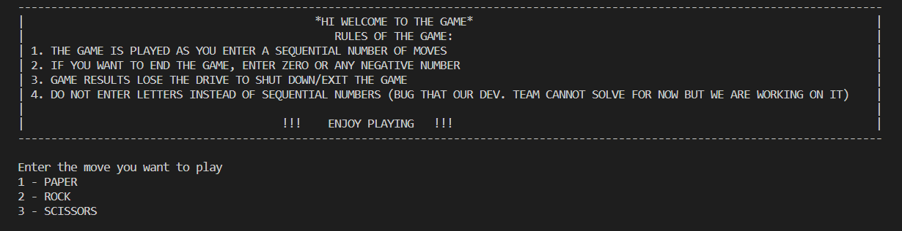
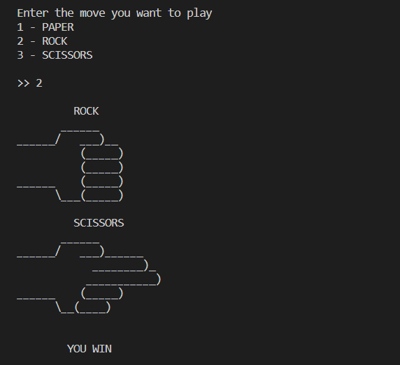

# Rock-Papers-Scissors-Game
This is a simple game of rock, paper, scissors played in a terminal against a computer bot.

The application that I created is a simple game called "Paper Rock Scissors." I developed this game as a personal project during a power outage when I didn't have internet access and was looking for a way to pass the time. As I couldn't find any games that could be played offline, I decided to create one myself.

The game is based on the classic childhood game that many of us played growing up. The rules are simple: players choose one of three options - paper, rock, or scissors - and reveal their choice at the same time. Paper beats rock, rock beats scissors, and scissors beat paper. 

The application is designed to be simple and easy to use, with intuitive controls and clear instructions. It is a great way to pass the time and have some fun, especially when internet access is not available.

---

- The terminal command to compile and run the game is:

``` Terminal
gcc Main.c -o Main
./Main.exe 
```

## This is the interface the player will encounter while playing this game:



Example of a couple of rounds of the game:

